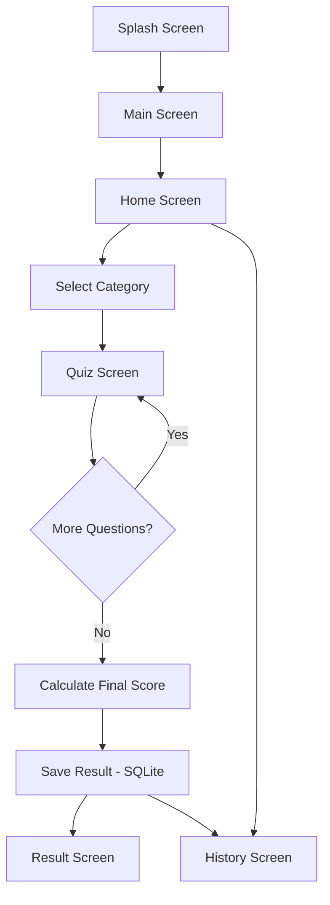
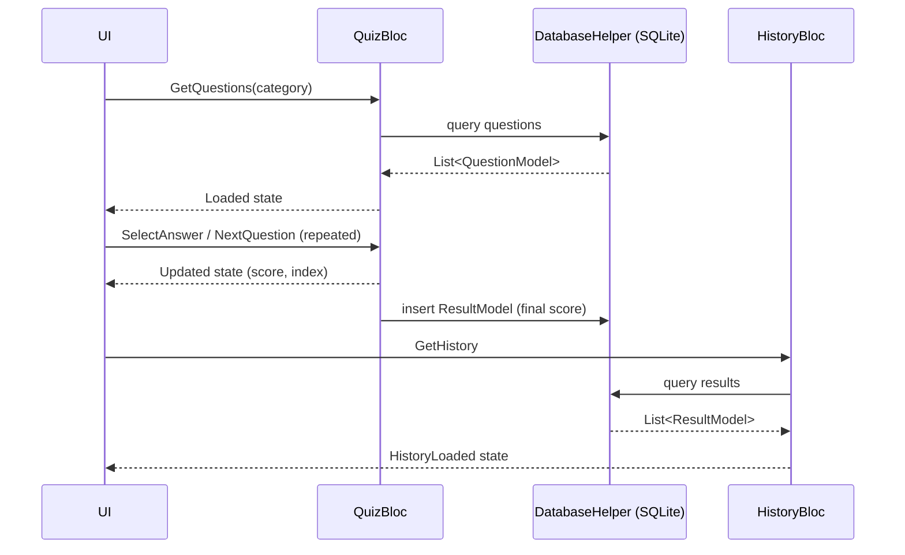
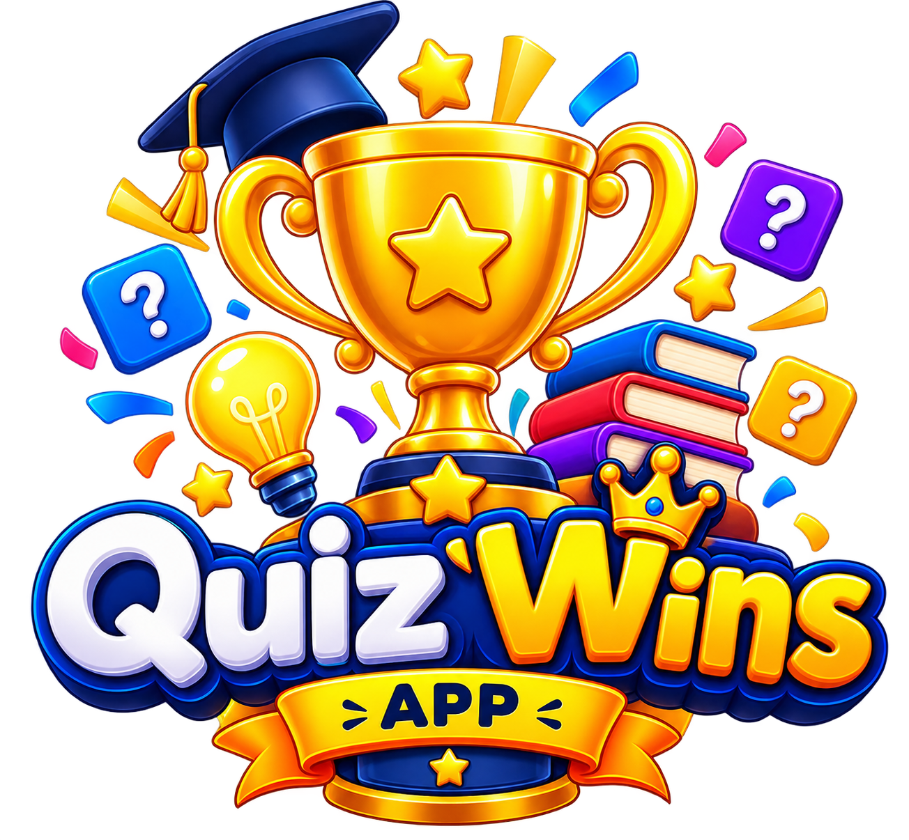
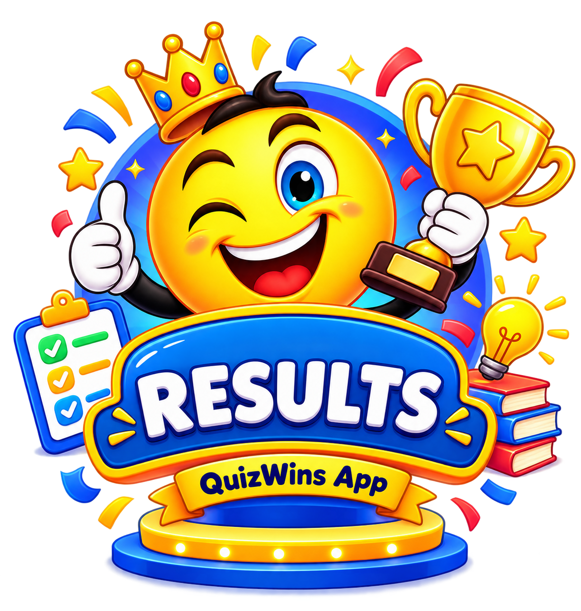

<div align="center">

# 🏆 QuizWins
### 🎯 Interactive Flutter Quiz Application


<br>


</div>

---

## 📱 About QuizWins

**QuizWins** is a Flutter-based interactive quiz application built during **Week 3 of my Flutter Development Internship at Owasoft Technologies Pvt. Ltd.**

The app lets a user pick a quiz category from the Home Screen, work through a set of multiple-choice questions, get instant feedback on each answer, and land on a Result Screen showing the final score. Every completed attempt is saved locally, so the History Screen always reflects past performance.

Beyond building a working quiz app, the goal of this project was to practice a proper Flutter architecture — separating UI from business logic with **BLoC**, structuring data with model classes, and persisting everything through a local **SQLite** database via **Sqflite**.

**Core stack used while building this:**

- Flutter & Dart
- BLoC (flutter_bloc) — Events and States
- Equatable — value comparison for events/states
- SQLite via Sqflite — local persistence
- Model classes for structured data
- Reusable, feature-based widget structure

---

## ⚡ Quick Overview

| | |
|---|---|
| **Project Name** | QuizWins |
| **Type** | Flutter Quiz Application |
| **Internship** | Owasoft Technologies Pvt. Ltd. |
| **Internship Week** | Week 3 |
| **Language** | Dart |
| **Framework** | Flutter |
| **State Management** | BLoC (flutter_bloc + Equatable) |
| **Database** | SQLite (local, on-device) |
| **DB Package** | Sqflite |
| **Data Flow** | Event → BLoC → Database → State → UI |
| **Platform** | Android (Flutter, cross-platform capable) |

---

## 🎓 Internship Information

| Information | Details |
|---|---|
| Organization | Owasoft Technologies Pvt. Ltd. |
| Internship | Flutter Development Internship |
| Week | Week 3 |
| Project | QuizWins |
| Platform | Flutter |
| Language | Dart |
| State Management | BLoC |
| Database | SQLite |
| Database Package | Sqflite |
| Comparison Package | Equatable |

---

## 🎯 Project Objectives

This Week 3 project was built to strengthen practical knowledge of Flutter application architecture and local data management, beyond just producing a working UI.

**Main objectives:**

- Build a complete, working quiz application
- Structure the project cleanly by feature
- Support multiple quiz categories
- Store quiz questions locally
- Retrieve questions from SQLite at runtime
- Display questions dynamically based on category
- Handle multiple-choice answer selection
- Validate the selected answer against the correct one
- Calculate the score as the quiz progresses
- Persist quiz results after completion
- Display results on a dedicated Result Screen
- Build a History screen to review past attempts
- Practice BLoC state management with Events and States
- Keep UI widgets separate from business/data logic
- Use model classes instead of raw maps in the UI layer
- Build reusable widgets across screens
- Improve overall navigation and user experience

---

## ✨ Main Features

- 🏠 **Home Screen** with multiple quiz categories to choose from
- ❓ **Multiple-choice questions**, presented one at a time per category
- ✅ **Instant answer feedback** — correct/incorrect checking on selection
- 📊 **Live score tracking** as the user progresses through the quiz
- ➡️ **Next Question** navigation with question progress tracking
- 🏁 **Finish Quiz** flow that closes out the attempt and saves the result
- 🎉 **Result Screen** showing the final score for the attempt
- 🕘 **Quiz History** section listing previous attempts
- 💾 **Local persistence** — all questions and results stored via SQLite/Sqflite
- 🧩 **Reusable widgets** used across the Home, Quiz, Result, and History screens
- 🎨 **Custom UI components** built with Material widgets
- ⏳ **Loading / loaded / empty / error states**, handled through BLoC where implemented

---

## 🔄 Application Workflow

```text
Splash Screen
      ↓
Main Screen
      ↓
Home Screen
      ↓
Select Quiz Category
      ↓
Quiz Screen
      ↓
Answer Questions (one at a time)
      ↓
Finish Quiz
      ↓
Save Result to SQLite
      ↓
Result Screen
      ↓
History Screen (view past attempts)
```



---

## 🖥️ Screens Overview

### 1. Splash Screen
The entry point of the app, shown briefly before navigating into the Main Screen.

### 2. Main Screen
Acts as the wrapper/entry navigation point that routes the user into the Home Screen.

### 3. Home Screen
Displays the available quiz categories as cards. Each card typically shows:
- Quiz/category title
- Category icon
- Number of questions
- Navigation into the Quiz Screen for that category

### 4. Quiz Screen
Shows one question at a time along with its multiple-choice options.
- The user selects an answer
- The selection is checked against the correct answer
- The score updates accordingly
- The user moves to the next question until the quiz is finished

### 5. Result Screen
Displayed once the quiz is completed. Shows the final score for that attempt, calculated from the number of correct answers out of the total questions.

### 6. History Screen
Lists previously completed quiz attempts, pulled from the local database, so the user can track performance over time.

---

## 🧠 BLoC Architecture

QuizWins follows the standard BLoC data flow to keep the UI free of business logic:

```text
UI  →  Event  →  BLoC  →  Database / Business Logic  →  State  →  UI
```

The UI dispatches an **Event** (e.g., the user tapping an answer, or requesting questions for a category). The corresponding **BLoC** receives that event, talks to the database or performs the required logic, and emits a new **State**. The UI listens to the BLoC's state stream (via `BlocBuilder` / `BlocListener`) and rebuilds itself in response — it never touches the database or scoring logic directly.

Two BLoCs drive the app: **QuizBloc** and **HistoryBloc**.

### 🎮 QuizBloc — Detailed Flow

**Events:**
- `GetQuestions` — triggered when the user opens a quiz category; asks the BLoC to load that category's questions from the database.
- `SelectAnswer` — triggered when the user taps an option; carries the selected answer so the BLoC can check it against the correct one.
- `NextQuestion` — triggered when the user moves forward; advances the current question index.

**How it works:**
- On `GetQuestions`, the BLoC requests the relevant question set from the database layer and emits a loaded state containing the list of questions along with the starting position (current question index, score, and selection state reset).
- On `SelectAnswer`, the BLoC compares the tapped answer with the correct answer stored for that question, updates whether the selection `isCorrect`, and — if correct — increments the running score.
- On `NextQuestion`, the BLoC increments the current question index and resets the selected-answer state so the next question starts unanswered.
- When the final question has been answered and the user moves past it, the BLoC treats the quiz as complete: it builds a result from the final score and question count, and passes it to be saved through the database layer.
- Once the result is saved, the UI navigates from the Quiz Screen to the **Result Screen**, which reads the final score out of the completed state.

### 🕘 HistoryBloc — Detailed Flow

**Events:**
- `GetHistory` — triggered when the History Screen is opened; asks the BLoC to fetch all saved quiz results.

**States:**
- `HistoryLoading` — emitted immediately after `GetHistory`, while results are being fetched from the database.
- `HistoryLoaded` — emitted once the database returns the saved results; carries the list of past attempts for the UI to render.
- `HistoryError` — emitted if fetching the results fails, so the UI can show an appropriate error message instead of crashing or hanging.

**How it works:**
- The History Screen dispatches `GetHistory` on load.
- `HistoryBloc` calls into the database helper to query all stored results.
- `BlocBuilder` in the History Screen switches on the emitted state: showing a loading indicator for `HistoryLoading`, rendering the list of attempts for `HistoryLoaded`, or showing an error/empty message when there's nothing to display or the query fails.

---

## 🧮 Why Equatable?

BLoC compares events and states to decide whether the UI actually needs to rebuild. Without a proper equality check, Dart would compare objects by reference, so two states with identical data could still be treated as "different," causing unnecessary rebuilds — or the opposite problem, where a genuinely new state gets ignored.

**Equatable** solves this by letting events and states define their equality based on their field values (via `props`), rather than their memory reference. This keeps the BLoC layer efficient and predictable: a state is only treated as "changed" when its actual data changes.

---

## 💾 Database Architecture (SQLite via Sqflite)

QuizWins persists everything locally — there is no backend, API, or cloud database involved. All questions and quiz results are stored on-device using **SQLite**, accessed through the **Sqflite** Flutter package.

**Responsibilities of the database layer:**
- Creating/opening the local database file (using `sqflite` + `path` to resolve the on-device database path)
- Defining the database version and running table creation on first launch
- Storing quiz questions (question text, options, correct answer, category)
- Storing quiz results after each completed attempt (score, total questions, category/date depending on implementation)
- Serving question data back to `QuizBloc` when a category is opened
- Serving saved results back to `HistoryBloc` when the History Screen loads

**Typical operations implemented:**
- **Insert** — writing a new quiz result once a quiz is completed
- **Query** — reading questions for a selected category, and reading all saved results for the History Screen

The BLoCs never talk to SQLite directly with raw queries — they go through a dedicated `DatabaseHelper`-style layer, which keeps the persistence logic in one place and out of the UI/business-logic layers.

### Data Flow Through the Database



---

## 🧱 Model Classes

QuizWins uses model classes to keep structured data flowing between the database and the UI, instead of passing raw `Map` objects around the app.

### QuestionModel
Represents a single quiz question, holding the question text, its answer options, and the correct answer (plus its category, where applicable). Converted from the raw database row into a typed object via a `fromMap()`-style constructor, so the BLoC and UI always work with a strongly-typed object rather than a `Map<String, dynamic>`.

### ResultModel
Represents a single completed quiz attempt — the score achieved and the total number of questions for that attempt. Built after a quiz finishes and passed to the database layer to be saved, and later reconstructed from stored rows (again via `fromMap()`) when the History Screen loads past results.

---

## 🏗️ Project Architecture

QuizWins follows a **feature-based structure**, separating each concern into its own layer:

- **Presentation (UI)** — Screens and widgets that render state and dispatch events. No business logic lives here.
- **Business Logic (BLoC)** — `QuizBloc` and `HistoryBloc`, each with their own events and states, handling all decision-making.
- **Data (Models + Database)** — `QuestionModel`, `ResultModel`, and `DatabaseHelper`, responsible for structured data and persistence.

This keeps each layer testable and replaceable on its own — for example, the database layer could be swapped out without touching the UI, as long as it keeps returning the same models.

---

## 📁 Project Structure

```text
lib/
├── main.dart
├── app.dart
├── app_theme.dart
│
├── blocs/
│   ├── quiz/
│   │   ├── quiz_bloc.dart
│   │   ├── quiz_event.dart
│   │   └── quiz_state.dart
│   └── history/
│       ├── history_bloc.dart
│       ├── history_event.dart
│       └── history_state.dart
│
├── models/
│   ├── question_model.dart
│   └── result_model.dart
│
├── database/
│   └── database_helper.dart
│
└── screens/
    ├── home_screen.dart
    ├── quiz_screen.dart
    ├── result_screen.dart
    └── history_screen.dart
```

> Folder names above reflect the logical grouping of the files listed for this project (BLoC files, models, database helper, and screens). Adjust the tree to match your exact folder layout if it differs.

---

## 🧰 Technologies & Packages

| Package | Purpose |
|---|---|
| `flutter_bloc` | BLoC-based state management (Events → States) |
| `equatable` | Value-based comparison for BLoC events/states |
| `sqflite` | Local SQLite database access |
| `path` | Resolving the on-device database file path |

---

## ⚙️ Installation & Setup

**Prerequisites:**
- Flutter SDK installed and configured
- Android Studio / VS Code with the Flutter & Dart plugins
- A connected device or emulator

**Steps:**

```bash
# 1. Clone the repository
git clone https://github.com/<your-username>/quizwins.git

# 2. Move into the project directory
cd quizwins

# 3. Install dependencies
flutter pub get

# 4. Run the app
flutter run
```

---

## 📦 Building the APK

```bash
flutter build apk --release
```

The generated APK will be available at:

```text
build/app/outputs/flutter-apk/app-release.apk
```

---

## 🧪 Testing

Manual testing was performed by running through the full user journey — selecting a category, answering all questions, verifying correct/incorrect feedback and live score updates, completing the quiz, checking the Result Screen, and confirming the attempt appears correctly on the History Screen.

---

## 🖼️ Screenshots

> Screenshots are not currently included in this repository. Once available, add them to an `assets/images/` (or `screenshots/`) folder and reference them here, for example:
>
> ```markdown
> | Home | Quiz | Result | History |
> |---|---|---|---|
> |  |  |  |  |
> ```

---

## 📚 Learning Outcomes

Building QuizWins helped reinforce:

- Structuring a Flutter app around **BLoC** rather than mixing logic into widgets
- Designing clear **Events** and **States** for a real feature (not just a counter demo)
- Using **Equatable** to avoid redundant UI rebuilds
- Working with **SQLite** through **Sqflite** for local, offline persistence
- Converting raw database rows into typed **model classes**
- Structuring a project by feature for maintainability
- Managing navigation and state across multiple connected screens

---

## 🚀 Future Improvements

- Add more quiz categories and a larger question bank
- Add a timer per question / per quiz
- Add difficulty levels
- Add answer explanations after each question
- Add the ability to delete or clear quiz history
- Add unit and widget tests for BLoC logic
- Polish UI theming and add light/dark mode toggle

---

## 👨‍💻 Developer

**Built by:** Saud Masood
**Role:** Flutter Development Intern — Owasoft Technologies Pvt. Ltd.
**Project:** QuizWins — Week 3 Internship Project

---

## 🙏 Acknowledgment

Thanks to **Owasoft Technologies Pvt. Ltd.** for the opportunity and guidance during the Flutter Development Internship, and for the structure of this Week 3 task that pushed practical, hands-on learning of BLoC and local persistence in Flutter.

<div align="center">

⭐ If you found this project useful or interesting, consider giving it a star!

</div>
